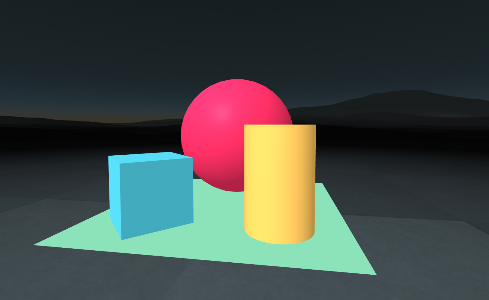

# aframe-seed

This project was generated with `angle` package which can be installed with `npm install angle` and generated with `npx angle initscene`

Built with [A-Frame](https://aframe.io).

To learn more about aframe, try out [A-Frame School](https://aframe.io/aframe-school/#/)

## Setup for local development

```sh
npm install
npm run start
```


## Deploy to SAP Business Technology Platform (BTP)

>You can create an account for free at [SAP Business Technology Platform](https://www.sap.com/products/business-technology-platform.html)

* Make sure you have the [Cloud Foundry Command Line Interface (cf CLI)](https://docs.cloudfoundry.org/cf-cli/) installed

* Update the `cf-login.sh` script with the values found in the SAP Busines Technology platform cockpit. Then run the script to login.

```bash
cf-login.sh
```

### Docker

>You can create a public registry with security scanning for free at [Quay.io](https://quay.io)

* Build and push the image with this script. You will have to edit the quay.io registry endpoint for the push command to work
```bash
docker-build.sh
```

* Run the continer with this script
```bash
docker-run.sh
```

### Buildpack

* Push your code directly without the need of a container registry with the following command


```bash
cf-push-buildpack.sh
```

* The application will be packaged as a runtime container on the platform using the [nodejs buildpack](https://docs.cloudfoundry.org/buildpacks/node/index.html) and a route automatically generated


